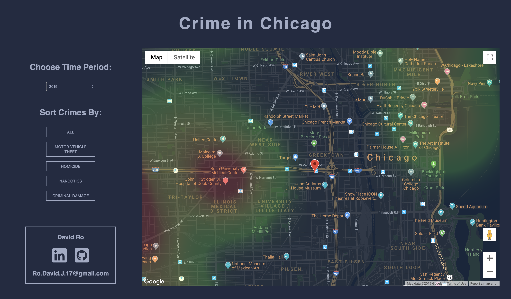

# Crime in Chicago README

[Crime in Chicago](https://shwogud.github.io/CrimeData/) is a crime visualization showing where the most Motor Vehicle Theft, Homicide, Narcotics, and Criminal Damage happens in Chicago between the years 2015 and 2019.

### Technologies Used
  + This web application was created by grabbing data from the city of Chicago crime API and mapping it using the google maps API. 
  + The loading time of the app was optimized by managing AJAX requests. Refactoring to only fetch the necessary data when needed helped maximize user experience and increase scalability.

  
### Key Features
  + Time Period Choice  
  Users can choose the time period of crime they wish to see. This can help visualize patterns over the years. 

  + Type of Crime  
    Users can also visualize data based on the type of crime, allowing them to see which parts of the city certain crimes are more likely to occur.

  
### Future Plans
  + Delete AJAX Request data after mapping to further increase efficiency
  + Fetch data from different cities and allow user to visualize crime in multiple cities

